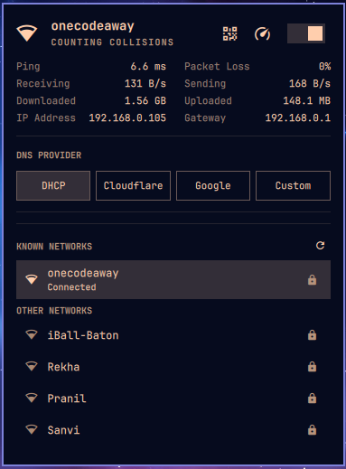
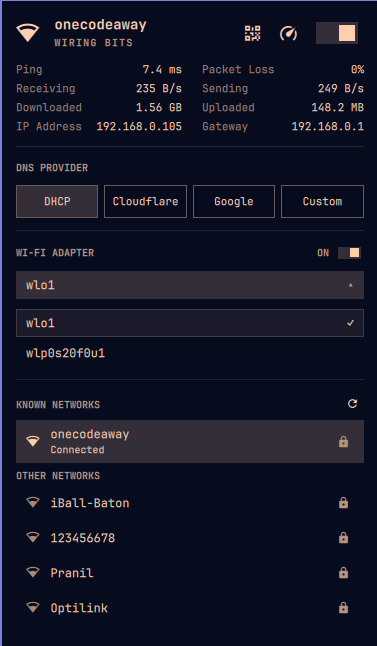
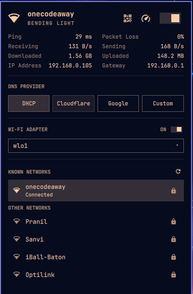
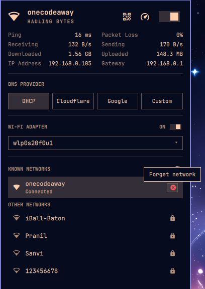

# Penguine Network

A cleaner, extended network widget for **Omarchy**.

Penguine Network started because I needed to use **multiple Wi-Fi adapters on my laptop**, something the original Omarchy network widget didn't handle the way I needed. I modified it into a cleaner UI with proper multi-adapter controls while keeping the Omarchy workflow familiar.

## Preview









## Features

* **Multiple Wi-Fi adapters** — support for multiple Wi-Fi adapters with automatic adapter controls when more than one is detected.
* **Per-adapter controls** — enable or disable individual Wi-Fi adapters independently.
* **Wi-Fi network scanning** — scan for nearby Wi-Fi networks and connect to available networks.
* **Re-scan nearby networks** — quickly scan for available Wi-Fi networks.
* **Keyboard shortcut** — press **`r`** while the Wi-Fi UI is open to rescan networks.
* **Forget saved networks** — remove saved Wi-Fi networks.
* Wi-Fi signal indicators
* Ethernet status
* Wi-Fi QR code
* Speed test

## Installation

```bash
curl -fsSL https://raw.githubusercontent.com/sudo-WearTherinG/penguine.network/main/install.sh | bash
```

The installer disables the original `omarchy.network`, installs Penguine Network, places it on the bar, and restarts the shell.

## Known Issue

**Bar position:** Omarchy may occasionally move the network widget to another position on the bar.

Restore it with:

```bash
omarchy bar move penguine.network --section right --after omarchy.bluetooth
omarchy restart shell
```

## Uninstall

```bash
omarchy plugin disable penguine.network
omarchy plugin remove penguine.network
omarchy plugin enable omarchy.network
omarchy restart shell
```

This removes Penguine Network and restores the original Omarchy network widget.

## License

Based on the original `omarchy.network` widget and modified for Penguine Network.
